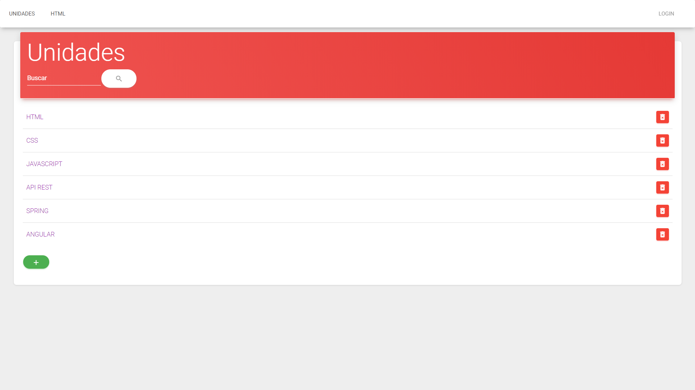
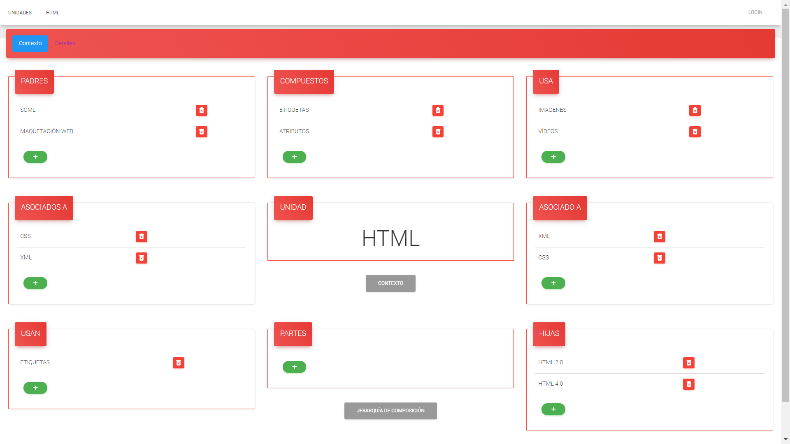
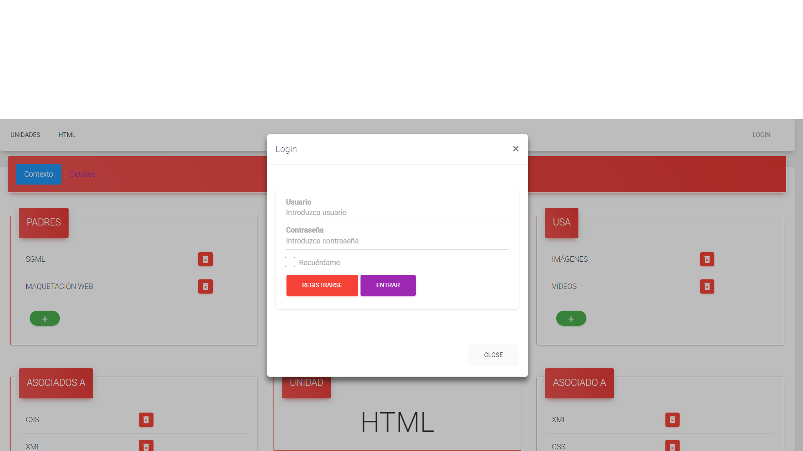

# RELMAN #

## GRUPO 11 ##

* **Enrique Pina Boyer**	
*e.pina.2016@alumnos.urjc.es*	
*KikeAjani*

* **Óscar Gómez Ramírez**	
*o.gomezr.2016@alumnos.urjc.es*	
*ogomezr*

* **Diego Muñoz Martin**	
*d.munozm.2016@alumnos.urjc.es*	
*DiegoMzmn*

* **Francisco Javier Gutiérrez Sánchez**
*fj.gutierrezs.2016@alumnos.urjc.es*	
*chicocoriano*

* **Jesús Horcajo Ortiz**	
*j.horcajo.2016@alumnos.urjc.es*
*itsjach*

## INFO ##

[Trello Grupo 11](https://trello.com/b/7mBmoTZa/daw11)

[Google Docs Grupo 11](https://docs.google.com/document/d/1dOFhYoHVeqbiS_8xWnMKT5sNLMF60pURrx-0x542xg8/edit)	

## CAPTURAS FASE 1 ##
**Unidades**

**Subunidades**

**Login**

